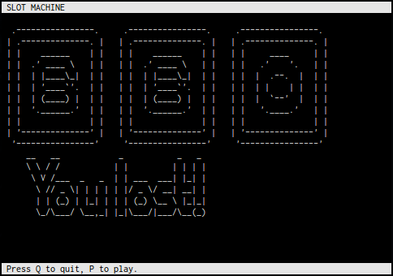

# Happy Slot Machine

This software is a python slot machine that cheats on the users.




## Usage

```ShellSession
$ python happy_slot_machine.py
```

This software has been written for python 3 but should also work on python 2.


## Numbers selection

Instead of drawing 3 random numbers, we draw 4 of them. If they are not all different or identical, two identical numbers are set on the first two positions and a different one in the third. Then, the three first are returned. Using 10 digits, this leads to a quite low chance of success and the probabilities to display a losing combination starting with 2 identical numbers are significantly high.

A perspicacious player could suspect the machine is cheating by observing that, in case of two identical numbers, the two first are always the identical ones. In order to prevent that, in this particular case, we add an extra rule: there is 25% chances first and third numbers are permuted and 25% chances second and third numbers are permuted.

* P(success) = 1/(10^3) = 0.001
* P(failure) = 1 - P(success) = 0.999
* P(all different) = (9*8*7) / 10^3 = 0.504
* P(failure & two identical) = 1 - P(success) - P(all different) = 0.495
* P(failure & first identical to second) = P(two identical) * 0.5 = 0.2475
* P(failure & first identical to third) = P(two identical) * 0.25 = 0.12375
* P(failure & second identical to third) = P(two identical) * 0.25 = 0.12375

In comparison, a non-manipulated machine would have the following probabilities:

* P(success) = 1/(10^2) = 0.01
* P(failure) = 1 - P(success) = 0.99
* P(all different) = (9*8) / 10^2 = 0.72
* P(failure & two identical) = 1 - P(success) - P(all different) = 0.27
* P(failure & first identical to second) = P(two identical) * (1/3) = 0.09
* P(failure & first identical to third) = P(two identical) * (1/3) = 0.09
* P(failure & second identical to third) = P(two identical) * (1/3) = 0.09
